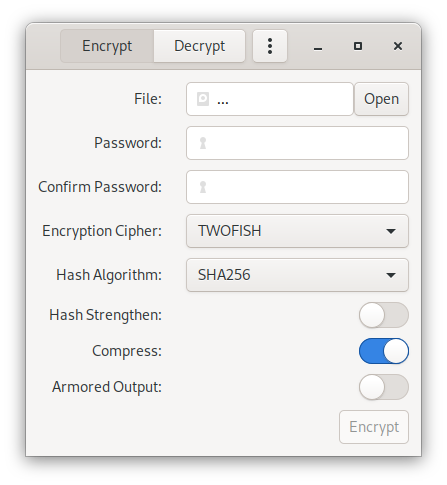

# GPG-Gui

### Graphical user interface for GnuPG (GPG) file encryption





## Purpose

A simple GUI frontend that interacts with the GPG application to encrypt and
decrypt files symmetrically (using passwords not private / public keys).

The GUI provides a convenient way to use GPG, rather than through the terminal,
making it usable for unexperienced users.


## Requirements

### Requirements at runtime

+ GnuPG  
  (Just the `gpg` or `gpg2` binary)
+ GTK+ 3  
  (Very likely already installed in your favourite Linux distribution)


### Build requirements

+ Vala Compiler (*valac*)  
  Likely available in your distributions repositories
+ [Meson](https://mesonbuild.com) build system (probably with
  [Ninja](https://ninja-build.org) backend)  
  Likely available in your distributions repositories
+ C Compiler  
  *Clang* or *gcc* are tested. Probably best to install your distributions
  development *meta package* / *bundle* / *group*.
+ GTK+ 3
  - Its header files  
    (Probably installable via a *-dev* or *-devel* package in your distro)
  - Its vala `.vapi` file  
    (Either included with vala compiler or GTK+ 3 development package)
+ GLib, GObject
  - Their header files
  - Their vala `.vapi` files
  - They are a dependency of GTK+ 3 and will probably be installed
    automatically when installing development package for GTK+ 3


## Build

Build out-of-tree with Meson and Ninja:

```bash
meson setup build
ninja -C build
```

Configure build directory and install:

```bash
meson configure -Dprefix=/usr build
meson configure -Dbuildtype=release build
sudo ninja -C build install
```

## Contributors

+ [Ansgar Klein](https://github.com/AnsgarKlein)
+ [Tinram](https://github.com/Tinram)


## License

GPG-Gui is released under the [GPL v.3](https://www.gnu.org/licenses/gpl-3.0.html).
